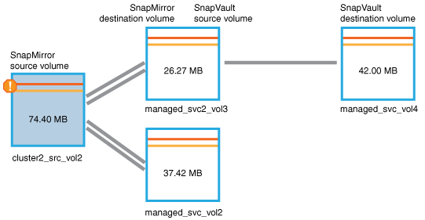

= Identificazione del problema ed esecuzione di azioni correttive per un lavoro di protezione non riuscito
:allow-uri-read: 
:icons: font
:imagesdir: ../media/

[role="lead"]
Esaminare il messaggio di errore del lavoro nel campo cause della pagina Dettagli evento e determinare che il lavoro non è riuscito a causa di un errore di copia Snapshot. Per ottenere ulteriori informazioni, accedere alla pagina Health/Volume Details (Dettagli salute/volume).

== Prima di iniziare

È necessario disporre del ruolo di amministratore di OnCommand.

== A proposito di questa attività

Il messaggio di errore fornito nel campo causa della pagina Dettagli evento contiene il seguente testo relativo al processo non riuscito:

[listing]
----
Protection Job Failed. Reason: (Transfer operation for
relationship 'cluster2_src_svm:cluster2_src_vol2->cluster3_dst_svm:
managed_svc2_vol3' ended unsuccessfully. Last error reported by
Data ONTAP: Failed to create Snapshot copy 0426cluster2_src_vol2snap
on volume cluster2_src_svm:cluster2_src_vol2. (CSM: An operation
failed due to an ONC RPC failure.).)
*Job Details*
----
Questo messaggio fornisce le seguenti informazioni:

* Un processo di backup o mirroring non è stato completato correttamente.
+
Il lavoro ha comportato una relazione di protezione tra il volume di origine `cluster2_src_vol2` sul server virtuale `cluster2_src_svm` e il volume di destinazione `managed_svc2_vol3` sul server virtuale denominato `cluster3_dst_svm`.

* Un lavoro di copia Snapshot non è riuscito per `0426cluster2_src_vol2snap` sul volume di origine `cluster2_src_svm:/cluster2_src_vol2`.

In questo scenario, è possibile identificare la causa e le potenziali azioni correttive dell'errore del processo. Tuttavia, la risoluzione del problema richiede l'accesso all'interfaccia utente Web di Gestione sistema o ai comandi dell'interfaccia utente di ONTAP.

== Fasi

. Il messaggio di errore viene esaminato e si determina che un lavoro di copia Snapshot non è riuscito sul volume di origine, indicando che probabilmente si è verificato un problema con il volume di origine.
+
In alternativa, è possibile fare clic sul collegamento *Dettagli lavoro* alla fine del messaggio di errore, ma per gli scopi di questo scenario si sceglie di non farlo.

. Si decide di tentare di risolvere l'evento, quindi eseguire le seguenti operazioni:
+
.. Fare clic sul pulsante *Assegna a* e selezionare *Me* dal menu.
.. Fare clic sul pulsante *Acknowledge* (Conferma) per non continuare a ricevere notifiche di avviso ripetute, se sono stati impostati avvisi per l'evento.
.. In alternativa, è possibile aggiungere note sull'evento.

. Fare clic sul campo *Source* (origine) nel riquadro *Summary* (Riepilogo) per visualizzare i dettagli sul volume di origine.
+
Il campo *origine* contiene il nome dell'oggetto di origine: In questo caso, il volume su cui è stato pianificato il lavoro di copia Snapshot.

+
Viene visualizzata la pagina Health/Volume Details (Dettagli stato/volume) per `cluster2_src_vol2`, Che mostra il contenuto della scheda protezione.

. Osservando il grafico della topologia di protezione, viene visualizzata un'icona di errore associata al primo volume della topologia, ovvero il volume di origine per la relazione SnapMirror.
+
Vengono inoltre visualizzate le barre orizzontali nell'icona del volume di origine, che indicano le soglie di avviso e di errore impostate per tale volume.

+

. Posizionare il cursore sull'icona di errore per visualizzare la finestra di dialogo a comparsa che visualizza le impostazioni di soglia e verificare che il volume abbia superato la soglia di errore, indicando un problema di capacità.
. Fare clic sulla scheda *Capacity*.
+
Informazioni sulla capacità del volume `cluster2_src_vol2` viene visualizzato.

. Nel riquadro *Capacity*, viene visualizzata un'icona di errore nel grafico a barre, che indica ancora una volta che la capacità del volume ha superato il livello di soglia impostato per il volume.
. Sotto il grafico della capacità, si vede che la crescita automatica del volume è stata disattivata e che è stata impostata una garanzia di spazio del volume.
+
Si potrebbe decidere di attivare la crescita automatica, ma ai fini di questo scenario, si decide di approfondire la ricerca prima di prendere una decisione su come risolvere il problema di capacità.

. Scorrere verso il basso fino all'elenco *Eventi* e verificare che siano stati generati gli eventi Protection Job Failed (processo di protezione non riuscito), Volume Days until Full (giorni volume fino al pieno) e Volume Space Full (spazio volume pieno).
. Nell'elenco *Eventi*, fare clic sull'evento *Volume Space Full* per ottenere ulteriori informazioni, avendo deciso che questo evento sembra più rilevante per il problema di capacità.
+
La pagina Dettagli evento visualizza l'evento Volume Space Full per il volume di origine.

. Nell'area *Riepilogo*, leggi il campo causa dell'evento: `The full threshold set at 90% is breached. 45.38 MB (95.54%) of 47.50 MB is used.`
. Sotto l'area *Summary* (Riepilogo), vengono visualizzate le azioni correttive suggerite.
+
[TIP]
====
Le azioni correttive suggerite vengono visualizzate solo per alcuni eventi, pertanto questa area non viene visualizzata per tutti i tipi di eventi.

====
+
Fare clic nell'elenco delle azioni consigliate che è possibile eseguire per risolvere l'evento Volume Space Full (spazio volume pieno):

+
** Abilitare la crescita automatica su questo volume.
** Ridimensionare il volume.
** Abilitare ed eseguire la deduplica su questo volume.
** Attivare ed eseguire la compressione su questo volume.

. Si decide di attivare la crescita automatica sul volume, ma per farlo, è necessario determinare lo spazio libero disponibile sull'aggregato di origine e il tasso di crescita del volume corrente:
+
.. Esaminare l'aggregato di origine, `cluster2_src_aggr1`Nel riquadro *Related Devices* (periferiche correlate).
+
[TIP]
====
È possibile fare clic sul nome dell'aggregato per ottenere ulteriori dettagli sull'aggregato.

====
+
Si determina che l'aggregato dispone di spazio sufficiente per abilitare la crescita automatica del volume.

.. Nella parte superiore della pagina, osservare l'icona che indica un incidente critico e consultare il testo sotto l'icona.
+
Si determina che "giorni a pieno: Meno di un giorno | tasso di crescita giornaliero: 5.4%".

. Accedere a Gestore di sistema o alla CLI ONTAP per attivare `volume autogrow` opzione.
+
[TIP]
====
Prendere nota dei nomi del volume e dell'aggregato in modo che siano disponibili quando si attiva la crescita automatica.

====
. Dopo aver risolto il problema di capacità, tornare alla pagina dei dettagli di Unified Manager**Event** e contrassegnare l'evento come risolto.

