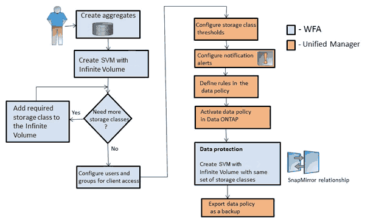

= Gestione del volume Infinite con classi di storage e policy sui dati
:allow-uri-read: 
:icons: font
:imagesdir: ../media/

[role="lead"]
Puoi gestire efficacemente il tuo Infinite Volume creando il volume Infinite con il numero richiesto di classi di storage, configurando le soglie per ciascuna classe di storage, creando regole e una policy sui dati per determinare il posizionamento dei dati scritti nel volume Infinite, configurando la protezione dei dati e, facoltativamente, configurando gli avvisi di notifica.

== Prima di iniziare

* È necessario installare OnCommand Workflow Automation (Wfa).
* È necessario disporre del ruolo di amministratore dello storage o amministratore dello storage di OnCommand.
* È necessario aver creato il numero richiesto di aggregati personalizzando il flusso di lavoro predefinito appropriato in WFA.
* È necessario aver creato il numero richiesto di classi di storage personalizzando il flusso di lavoro predefinito appropriato in WFA.
* È necessario aver configurato il server Unified Manager come origine dati in WFA, quindi verificare che i dati siano memorizzati correttamente nella cache.

== A proposito di questa attività

Durante l'esecuzione di questa attività, è necessario passare da un'applicazione all'altra: OnCommand Workflow Automation (WFA) e OnCommand Unified Manager.

L'attività prevede fasi di alto livello. Per ulteriori informazioni sull'esecuzione delle attività WFA, consultare la documentazione di _OnCommand Workflow Automation_.

== Fasi

. image:../media/wfa-icon.gif["Icona per la procedura WFA"] Personalizzare il flusso di lavoro predefinito per definire le classi di storage richieste.
. image:../media/wfa-icon.gif["Icona per la procedura WFA"] Creare una SVM con Infinite Volume con il numero richiesto di classi di storage utilizzando il flusso di lavoro appropriato.
. image:../media/um-icon.gif["Icona per la procedura Unified Manager"] Aggiungere il cluster contenente SVM con Infinite Volume al database di Unified Manager.
+
È possibile aggiungere il cluster fornendo l'indirizzo IP o l'FQDN del cluster.

. image:../media/um-icon.gif["Icona per la procedura Unified Manager"] xref:task-editing-storage-class-threshold-settings.adoc[In base ai requisiti dell'organizzazione, modificare le soglie per ciascuna classe di storage].
+
È necessario utilizzare le impostazioni predefinite della soglia della classe di storage per monitorare efficacemente lo spazio della classe di storage.

. image:../media/um-icon.gif["Icona per la procedura Unified Manager"] xref:task-adding-alerts.adoc[Configura avvisi e trap di notifica per risolvere eventuali problemi di disponibilità e capacità correlati al volume infinito].
. image:../media/um-icon.gif["Icona per la procedura Unified Manager"] xref:task-creating-rules.adoc[Impostare le regole nella policy sui dati, quindi attivare tutte le modifiche apportate alla policy sui dati]
+
Le regole di una policy sui dati determinano il posizionamento del contenuto scritto nel volume infinito.

+
[NOTE]
====
Le regole di una policy sui dati influiscono solo sui nuovi dati scritti nel volume infinito e non sui dati esistenti nel volume infinito.

====
. image:../media/wfa-icon.gif["Icona per la procedura WFA"] Creare una SVM di disaster recovery (DR) con Infinite Volume, quindi configurare una protezione dei dati (DP) seguendo la procedura riportata di seguito:
+
.. Creare un volume Infinito di protezione dei dati (DP) utilizzando il workflow appropriato.
.. Impostare una relazione mirror DP tra l'origine e la destinazione utilizzando il flusso di lavoro appropriato.

