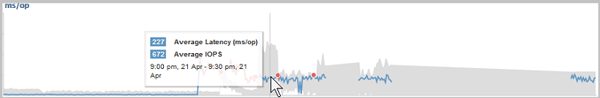
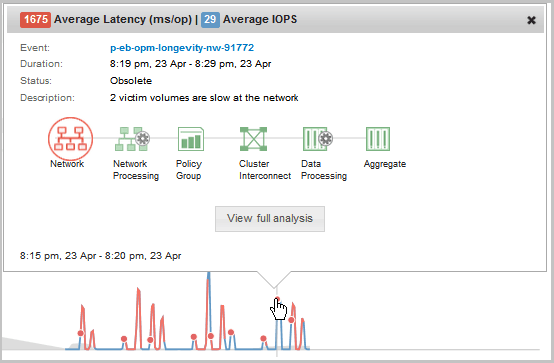

= Come funzionano i grafici dei dati delle performance
:allow-uri-read: 
:icons: font
:imagesdir: ../media/

[role="lead"]
Unified Manager utilizza grafici o grafici per mostrare le statistiche e gli eventi relativi alle performance dei volumi in un determinato periodo di tempo.

I grafici consentono di personalizzare l'intervallo di tempo per la visualizzazione dei dati. I dati vengono visualizzati con l'intervallo di tempo sull'asse orizzontale del grafico e i contatori sull'asse verticale, con intervalli di punti lungo le linee del grafico. L'asse verticale è dinamico; i valori si regolano in base ai picchi dei valori previsti o effettivi.

== Selezione di intervalli di tempo

Nella pagina Performance/Volume Details (Dettagli performance/volume), il grafico dei dati storici consente di selezionare un intervallo di tempo per tutti i grafici della pagina. I pulsanti 1d, 5d, 10d e 30d specificano da 1 giorno a 30 giorni (1 mese) e il pulsante *Custom* consente di specificare un intervallo di tempo personalizzato entro 30 giorni. Ogni punto di un grafico rappresenta un intervallo di raccolta di 5 minuti e viene conservato un massimo di 30 giorni di dati storici delle performance. Si noti che gli intervalli tengono conto anche dei ritardi di rete e di altre anomalie.

image::../media/opm-timeframe-selectors-jpg.gif[Selettori dei tempi in Performance Manager]

In questo esempio, il grafico dei dati storici ha un intervallo di tempo impostato all'inizio e alla fine del mese di marzo. Nell'intervallo di tempo selezionato, tutti i dati storici prima di marzo sono disattivati.

== Visualizzazione delle informazioni sui punti dati

Per visualizzare le informazioni relative ai punti di dati su un grafico, posizionare il cursore su un punto specifico all'interno del grafico e visualizzare una finestra a comparsa che elenca il valore e le informazioni relative a data e ora.

In questo esempio, posizionando il cursore sul grafico IOPS nella pagina Performance/Volume Details (Dettagli performance/volume) vengono visualizzati i valori relativi al tempo di risposta e alle operazioni tra le 3:50 del mattino e alle 3:55 Il 20 ottobre.

== Visualizzazione delle informazioni sugli eventi relativi alle performance

Per visualizzare le informazioni sugli eventi in un grafico, posizionare il cursore sull'icona di un evento per visualizzare le informazioni di riepilogo in una finestra a comparsa oppure fare clic sull'icona dell'evento per ottenere informazioni più dettagliate.

In questo esempio, nella pagina Performance/Volume Details (Dettagli performance/volume), facendo clic sull'icona di un evento nel grafico della latenza vengono visualizzate informazioni dettagliate sull'evento in una finestra a comparsa. L'evento viene evidenziato anche nell'elenco degli eventi.
