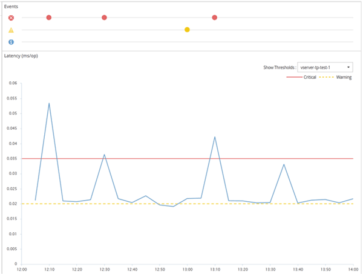

= Come funzionano le policy di soglia delle performance definite dall'utente
:allow-uri-read: 
:icons: font
:imagesdir: ../media/

[role="lead"]
È possibile impostare criteri di soglia delle performance sugli oggetti storage (ad esempio, su aggregati e volumi) in modo che un evento possa essere inviato all'amministratore dello storage per informare l'amministratore che il cluster sta riscontrando un problema di performance.

È possibile creare un criterio di soglia delle performance per un oggetto di storage:

* Selezione di un oggetto di storage
* Selezione di un contatore di performance associato a quell'oggetto
* Specificare i valori che definiscono i limiti superiori del contatore delle prestazioni considerati situazioni critiche e di avviso
* Specificare un periodo di tempo che definisce il tempo per il quale il contatore deve superare il limite massimo

Ad esempio, è possibile impostare un criterio di soglia delle performance su un volume in modo da ricevere una notifica di eventi critici ogni volta che gli IOPS per quel volume superano le 750 operazioni al secondo per 10 minuti consecutivi. Questo stesso criterio di soglia può anche specificare che un evento di avviso deve essere inviato quando IOPS supera 500 operazioni al secondo per 10 minuti.

[NOTE]
====
La release corrente fornisce soglie che inviano eventi quando un valore del contatore supera l'impostazione della soglia. Non è possibile impostare soglie che inviino eventi quando un valore del contatore scende al di sotto di un'impostazione di soglia.

====
Viene visualizzato un esempio di tabella dei contatori, che indica che una soglia di avviso (icona gialla) è stata violata alle 1:00 e che una soglia critica (icona rossa) è stata violata alle 12:10, 12:30 e 1:10:

Una violazione di soglia deve verificarsi continuamente per la durata specificata. Se la soglia scende al di sotto dei valori limite per qualsiasi motivo, una successiva violazione viene considerata l'inizio di una nuova durata.

Alcuni oggetti cluster e contatori delle performance consentono di creare una policy di soglia combinata che richiede che due contatori delle performance superino i limiti massimi prima che venga generato un evento. Ad esempio, è possibile creare un criterio di soglia utilizzando i seguenti criteri:

|===
| Oggetto cluster | Contatore delle performance | Soglia di avviso | Soglia critica | Durata 

 a| 
Volume
 a| 
Latenza
 a| 
10 millisecondi
 a| 
20 millisecondi
 a| 
15 minuti

|===
I criteri di soglia che utilizzano due oggetti cluster generano un evento solo quando entrambe le condizioni vengono violate. Ad esempio, utilizzando il criterio di soglia definito nella tabella:

|===

| Se la latenza del volume è in media... | E l'utilizzo dei dischi aggregati è... | Quindi... 

 a| 
15 millisecondi
 a| 
50%
 a| 
Nessun evento segnalato.

 a| 
15 millisecondi
 a| 
75%
 a| 
Viene segnalato un evento di avviso.

 a| 
25 millisecondi
 a| 
75%
 a| 
Viene segnalato un evento di avviso.

 a| 
25 millisecondi
 a| 
90%
 a| 
Viene segnalato un evento critico.

|===