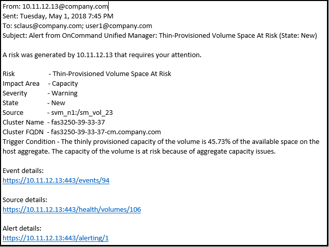

= Quali informazioni sono contenute in un messaggio di posta elettronica di avviso
:allow-uri-read: 
:icons: font
:imagesdir: ../media/

[role="lead"]
Le email di avviso di Unified Manager forniscono il tipo di evento, la severità dell'evento, il nome della policy che è stata violata per causare l'evento e una descrizione dell'evento. Il messaggio di posta elettronica fornisce inoltre un collegamento ipertestuale per ciascun evento che consente di visualizzare la pagina dei dettagli dell'evento nell'interfaccia utente.

Le email di avviso vengono inviate a tutti gli utenti che si sono abbonati per ricevere avvisi.

Se un contatore di performance o un valore di capacità presenta una grande modifica durante un periodo di raccolta, potrebbe causare l'attivazione contemporanea di un evento critico e di un avviso per la stessa policy di soglia. In questo caso, è possibile ricevere un'e-mail per l'evento di avviso e un'email per l'evento critico. In quanto Unified Manager ti consente di iscriverti separatamente per ricevere avvisi in caso di avvisi e violazioni di soglia critiche.

[NOTE]
====
Dopo l'aggiornamento a Unified Manager 7.2 o versione successiva, i collegamenti a eventi e avvisi provenienti da e-mail inviate da versioni precedenti di Unified Manager non funzioneranno più a causa di una modifica degli URL degli eventi e degli avvisi.

====
Di seguito è riportato un esempio di messaggio di avviso:

