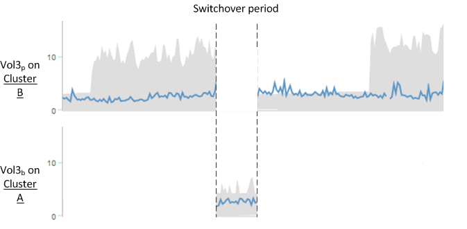

= Comportamento del volume durante lo switchover e lo switchback
:allow-uri-read: 
:icons: font
:imagesdir: ../media/

[role="lead"]
Gli eventi che attivano uno switchover o uno switchback causano lo spostamento dei volumi attivi da un cluster all'altro nel gruppo di disaster recovery. I volumi sul cluster attivi e che forniscono dati ai client vengono arrestati e i volumi sull'altro cluster vengono attivati e iniziano a servire i dati. Unified Manager monitora solo i volumi attivi e in esecuzione.

Poiché i volumi vengono spostati da un cluster all'altro, si consiglia di monitorare entrambi i cluster. Una singola istanza di Unified Manager può monitorare entrambi i cluster in una configurazione MetroCluster, ma a volte la distanza tra le due posizioni richiede l'utilizzo di due istanze di Unified Manager per monitorare entrambi i cluster. La figura seguente mostra una singola istanza di Unified Manager:

image::../media/opm-mcc-switchover.gif[switchover opm mcc]

I volumi con p nei loro nomi indicano i volumi primari e i volumi con b nei loro nomi sono volumi di backup mirrorati creati da SnapMirror.

Durante il normale funzionamento:

* Il cluster A ha due volumi attivi: Vol1p e Vol2p.
* Il cluster B ha due volumi attivi: Vol3p e Vol4p.
* Il cluster A ha due volumi inattivi: Vol3b e Vol4b.
* Il cluster B ha due volumi inattivi: Vol1b e Vol2b.

Unified Manager raccoglie le informazioni relative a ciascuno dei volumi attivi (statistiche, eventi e così via). Le statistiche Vol1p e Vol2p vengono raccolte dal cluster A e le statistiche Vol3p e Vol4p vengono raccolte dal cluster B.

Dopo un guasto catastrofico che causa lo switchover dei volumi attivi dal cluster B al cluster A:

* Il cluster A ha quattro volumi attivi: Vol1p, Vol2p, Vol3b e Vol4b.
* Il cluster B ha quattro volumi inattivi: Vol3p, Vol4p, Vol1b e Vol2b.

Come durante il normale funzionamento, Unified Manager raccoglie le informazioni relative a ciascuno dei volumi attivi. Tuttavia, in questo caso, le statistiche Vol1p e Vol2p vengono raccolte dal cluster A, mentre le statistiche Vol3b e Vol4b vengono raccolte anche dal cluster A.

Si noti che Vol3p e Vol3b non sono gli stessi volumi, perché si trovano su cluster diversi. Le informazioni di Unified Manager per Vol3p non sono le stesse di Vol3b:

* Durante il passaggio al cluster A, le statistiche e gli eventi di Vol3p non sono visibili.
* Al primo passaggio, Vol3b sembra un nuovo volume senza informazioni storiche.

Quando il cluster B viene riparato e viene eseguito uno switchback, il Vol3p viene nuovamente attivato sul cluster B, con le statistiche storiche e un intervallo di statistiche per il periodo durante lo switchover. Vol3b non è visualizzabile dal cluster A fino a quando non si verifica un altro switchover:

[NOTE]
====
* I volumi MetroCluster inattivi, ad esempio Vol3b sul cluster A dopo lo switchback, vengono identificati con il messaggio "`questo volume è stato cancellato`". Il volume non viene effettivamente eliminato, ma non viene attualmente monitorato da Unified Manager perché non è il volume attivo.
* Se un singolo Unified Manager sta monitorando entrambi i cluster in una configurazione MetroCluster, la ricerca del volume restituisce informazioni per il volume attivo in quel momento. Ad esempio, una ricerca di "`Vol3`" restituisce statistiche ed eventi per Vol3b sul cluster A se si è verificato uno switchover e Vol3 è diventato attivo sul cluster A.

====