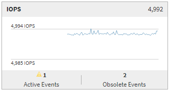

= Pagina di riepilogo
:allow-uri-read: 
:icons: font
:imagesdir: ../media/

[role="lead"]
La pagina Summary (Riepilogo) visualizza i diagrammi dei contatori che contengono dettagli sugli eventi e sulle performance per oggetto per il periodo di 72 ore precedente. Questi dati non vengono aggiornati automaticamente, ma sono aggiornati al momento dell'ultimo caricamento della pagina. I grafici nella pagina di riepilogo rispondono alla domanda _devo approfondire?_

== Grafici e statistiche dei contatori

I grafici riepilogativi forniscono una panoramica rapida e di alto livello per le ultime 72 ore e consentono di identificare i possibili problemi che richiedono ulteriori indagini.

Le statistiche del contatore delle pagine di riepilogo vengono visualizzate in grafici.

È possibile posizionare il cursore sulla linea di trend in un grafico per visualizzare i valori del contatore per un determinato punto temporale. I grafici riepilogativi visualizzano anche il numero totale di eventi critici e di avviso attivi per il periodo di 72 ore precedente per i seguenti contatori:

* *Latenza*
+
Tempo medio di risposta per tutte le richieste i/o, espresso in millisecondi per operazione.

+
Visualizzato per tutti i tipi di oggetto.

* *IOPS*
+
Velocità operativa media; espressa in operazioni di input/output al secondo.

+
Visualizzato per tutti i tipi di oggetto.

* *Mbps*
+
Throughput medio, espresso in megabyte al secondo.

+
Visualizzato per tutti i tipi di oggetto.

* *Capacità di performance utilizzata*
+
Percentuale di capacità di performance consumata da un nodo o aggregato.

+
Visualizzato solo per nodi e aggregati. Questa tabella viene visualizzata solo quando si utilizza ONTAP 9.0 o una versione successiva del software.

* *Utilizzo*
+
Percentuale di utilizzo degli oggetti per nodi e aggregati o utilizzo della larghezza di banda per le porte.

+
Visualizzato solo per nodi, aggregati e porte.

Posizionando il cursore sul numero di eventi attivi, vengono visualizzati il tipo e il numero di eventi. Gli eventi critici sono visualizzati in rosso (image:../media/treemapred-png.gif["Icona di TreeMap – colore rosso"]) e gli eventi di avviso sono visualizzati in giallo (image:../media/treemapstatus-warning-png.gif["Icona di TreeMap – Stato avviso"]).

Il numero in alto a destra del grafico nella barra grigia è il valore medio delle ultime 72 ore. I numeri visualizzati nella parte inferiore e superiore del grafico a linee di trend sono i valori minimi e massimi per le ultime 72 ore. La barra grigia sotto il grafico contiene il numero di eventi attivi (nuovi e riconosciuti) e obsoleti degli ultimi 72 ore.

* *Grafico del contatore di latenza*
+
Il grafico del contatore di latenza fornisce una panoramica di alto livello della latenza dell'oggetto per il periodo di 72 ore precedente. La latenza si riferisce al tempo di risposta medio per tutte le richieste di i/o, espresso in millisecondi per operazione, tempo di servizio, tempo di attesa o entrambi sperimentati da un pacchetto di dati o da un blocco nel componente di storage del cluster in esame.

+
*Top (valore contatore):* il numero nell'intestazione visualizza la media per il periodo di 72 ore precedente.

+
*Middle (grafico delle performance):* il numero nella parte inferiore del grafico mostra la latenza più bassa, mentre il numero nella parte superiore del grafico mostra la latenza più elevata per il periodo precedente di 72 ore. Posizionare il cursore sulla linea di trend del grafico per visualizzare il valore di latenza per un tempo specifico.

+
*Bottom (eventi):* quando si passa il mouse, la finestra a comparsa visualizza i dettagli degli eventi. Fare clic sul collegamento *Eventi attivi* sotto il grafico per accedere alla pagina inventario eventi e visualizzare i dettagli completi dell'evento.

* *Grafico del contatore IOPS*
+
Il grafico del contatore IOPS fornisce una panoramica di alto livello dello stato degli IOPS degli oggetti per il periodo di 72 ore precedente. IOPS indica la velocità del sistema di storage in numero di operazioni di input/output al secondo.

+
*Top (valore contatore):* il numero nell'intestazione visualizza la media per il periodo di 72 ore precedente.

+
*Middle (grafico delle prestazioni):* il numero nella parte inferiore del grafico mostra gli IOPS più bassi, mentre il numero nella parte superiore del grafico mostra gli IOPS più elevati per il periodo di 72 ore precedente. Posizionare il cursore sulla linea di trend del grafico per visualizzare il valore IOPS per un tempo specifico.

+
*Bottom (eventi):* quando si passa il mouse, la finestra a comparsa visualizza i dettagli degli eventi. Fare clic sul collegamento *Eventi attivi* sotto il grafico per accedere alla pagina inventario eventi e visualizzare i dettagli completi dell'evento.

* *Grafico contatore Mbps*
+
Il grafico del contatore Mbps visualizza le prestazioni di Object Mbps e indica la quantità di dati trasferiti da e verso l'oggetto in megabyte al secondo. Il grafico del contatore Mbps fornisce una panoramica di alto livello dello stato di Mbps dell'oggetto per il periodo di 72 ore precedente.

+
*Top (valore contatore):* il numero nell'intestazione visualizza il numero medio di Mbps per il periodo di 72 ore precedente.

+
*Middle (grafico delle prestazioni):* il valore nella parte inferiore del grafico mostra il numero più basso di Mbps, mentre il valore nella parte superiore del grafico mostra il numero più alto di Mbps per il periodo precedente di 72 ore. Posizionare il cursore sulla linea di trend del grafico per visualizzare il valore Mbps per un determinato periodo di tempo.

+
*Bottom (eventi):* quando si passa il mouse, la finestra a comparsa visualizza i dettagli degli eventi. Fare clic sul collegamento *Eventi attivi* sotto il grafico per accedere alla pagina inventario eventi e visualizzare i dettagli completi dell'evento.

* *Grafico contatore capacità di performance utilizzata*
+
Il grafico contatore capacità di performance utilizzata visualizza la percentuale di capacità di performance consumata dall'oggetto.

+
*Top (valore del contatore):* il numero nell'intestazione visualizza la capacità media utilizzata per le performance del periodo precedente di 72 ore.

+
*Middle (grafico delle performance):* il valore nella parte inferiore del grafico mostra la percentuale di capacità delle performance più bassa utilizzata, mentre il valore nella parte superiore del grafico mostra la percentuale di capacità delle performance più elevata utilizzata per il periodo di 72 ore precedente. Posizionare il cursore sulla linea di trend del grafico per visualizzare il valore della capacità di performance utilizzata per un tempo specifico.

+
*Bottom (eventi):* quando si passa il mouse, la finestra a comparsa visualizza i dettagli degli eventi. Fare clic sul collegamento *Eventi attivi* sotto il grafico per accedere alla pagina inventario eventi e visualizzare i dettagli completi dell'evento.

* *Grafico contatore di utilizzo*
+
Il grafico del contatore di utilizzo visualizza la percentuale di utilizzo degli oggetti. Il grafico del contatore di utilizzo fornisce una panoramica di alto livello della percentuale di utilizzo dell'oggetto o della larghezza di banda per il periodo di 72 ore precedente.

+
*Top (valore contatore):* il numero nell'intestazione visualizza la percentuale di utilizzo media per il periodo di 72 ore precedente.

+
*Middle (grafico delle performance):* il valore nella parte inferiore del grafico mostra la percentuale di utilizzo più bassa e il valore nella parte superiore del grafico mostra la percentuale di utilizzo più alta per il periodo di 72 ore precedente. Posizionare il cursore sulla linea di trend del grafico per visualizzare il valore di utilizzo per un tempo specifico.

+
*Bottom (eventi):* quando si passa il mouse, la finestra a comparsa visualizza i dettagli degli eventi. Fare clic sul collegamento *Eventi attivi* sotto il grafico per accedere alla pagina inventario eventi e visualizzare i dettagli completi dell'evento.

== Eventi

La tabella della cronologia degli eventi, se applicabile, elenca gli eventi più recenti che si sono verificati in quell'oggetto. Facendo clic sul nome dell'evento, i dettagli dell'evento vengono visualizzati nella pagina Dettagli evento.
