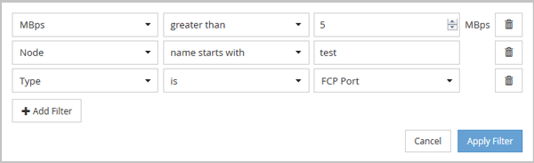

= Filtraggio del contenuto della pagina dell'inventario delle performance
:allow-uri-read: 
:icons: font
:imagesdir: ../media/

[role="lead"]
È possibile filtrare i dati dell'inventario delle performance in Unified Manager per individuare rapidamente i dati in base a criteri specifici. È possibile utilizzare il filtraggio per restringere il contenuto delle pagine di Unified Manager e visualizzare solo i risultati desiderati. In questo modo si ottiene un metodo molto efficiente per visualizzare solo i dati relativi alle performance di cui si è interessati.

== A proposito di questa attività

Utilizzare *Filtering* per personalizzare la vista griglia in base alle proprie preferenze. Le opzioni di filtro disponibili si basano sul tipo di oggetto visualizzato nella griglia. Se i filtri sono attualmente applicati, viene visualizzato un asterisco (*) a sinistra del controllo di filtraggio.

Sono supportati quattro tipi di parametri di filtro.

|===
| Parametro | Convalida 

 a| 
Stringa (testo)
 a| 
Gli operatori sono *contains* e *inizia con*.

 a| 
Numero
 a| 
Gli operatori sono *maggiori di* e *minori di*.

 a| 
Risorsa
 a| 
Gli operatori sono *nome contiene* e *nome inizia con*.

 a| 
Stato
 a| 
Gli operatori sono *IS* e *non*.

|===
Tutti e tre i campi sono obbligatori per ciascun filtro; i filtri disponibili riflettono le colonne filtrabili nella pagina corrente. Il numero massimo di filtri che è possibile applicare è quattro. I risultati filtrati si basano su parametri di filtro combinati. I risultati filtrati si applicano a tutte le pagine della ricerca filtrata, non solo alla pagina attualmente visualizzata.

È possibile aggiungere filtri utilizzando il pannello di filtraggio.

. Nella parte superiore della pagina, fare clic su *Filtering* (filtraggio). Viene visualizzato il pannello Filtering.
. Nel pannello Filtering (filtraggio), fare clic sull'elenco a discesa a sinistra e selezionare un nome di oggetto, ad esempio _Cluster_ o un contatore delle prestazioni.
. Fare clic sull'elenco a discesa centrale e selezionare l'operatore booleano *name contains* o *name starts with* se la prima selezione era un nome di oggetto. Se la prima selezione era un contatore delle prestazioni, selezionare *maggiore di* o *minore di*. Se la prima selezione era *Status*, selezionare *is* o *is not*.
. Se i criteri di ricerca richiedono un valore numerico, i pulsanti freccia su e giù vengono visualizzati nel campo a destra. È possibile fare clic sui pulsanti freccia su e giù per visualizzare il valore numerico desiderato.
. Se necessario, digitare i criteri di ricerca non numerici nel campo di testo a destra.
. Per aggiungere filtri, fare clic su *Aggiungi filtro*. Viene visualizzato un campo di filtro aggiuntivo. Completare questo filtro seguendo la procedura descritta nei passaggi precedenti. Si noti che quando si aggiunge il quarto filtro, il pulsante *Add Filter* (Aggiungi filtro) non viene più visualizzato.
. Fare clic su *Applica filtro*. Le opzioni di filtro vengono applicate alla griglia e viene visualizzato un asterisco (*) nel pulsante di filtraggio.
. Utilizzare il pannello di filtraggio per rimuovere i singoli filtri facendo clic sull'icona del cestino a destra del filtro da rimuovere.
. Per rimuovere tutti i filtri, fare clic su *Reset* nella parte inferiore del pannello di filtraggio.

== Esempio di filtraggio

La figura mostra il pannello di filtraggio con tre filtri. Il pulsante *Add Filter* (Aggiungi filtro) viene visualizzato quando si dispone di un numero inferiore al massimo di quattro filtri.

Dopo aver fatto clic su *Apply Filter* (Applica filtro), il pannello Filtering (filtraggio) si chiude e applica i filtri.
